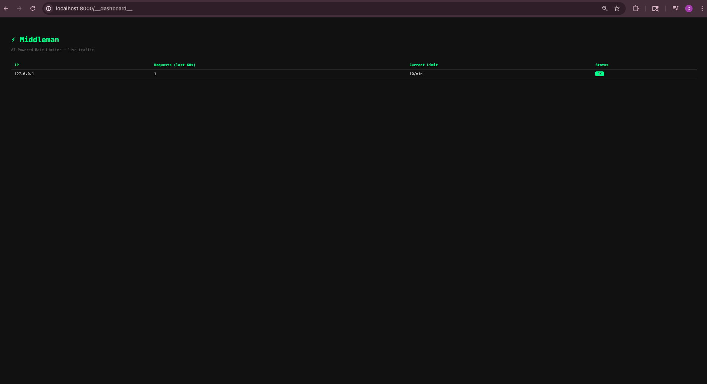

# Middleman

A reverse proxy that uses AI to dynamically rate limit users based on behavior, not just fixed rules.

Most rate limiters apply a blanket rule to everyone. Middleman watches how each user behaves, and when they get blocked, an LLM classifies them (NORMAL / AGGRESSIVE / BOT / HEAVY_USER) and adjusts their personal limit accordingly.

---

## How it works
```bash
Client → Middleman → Target API
↑
checks Redis
if blocked → calls Groq LLM → adjusts limit → 429
if allowed → forwards request → returns response
```
---

## Stack

- **FastAPI** — web server and routing
- **Redis** — sliding window rate limiting
- **Groq (LLama 3.3)** — behavior classification
- **Docker** — running Redis locally
---

## Getting started

**1. Clone the repo**
```bash
git clone https://github.com/chhaviluthra08/Middleman.git
cd Middleman
```

**2. Create and activate a virtual environment**
```bash
python -m venv venv
source venv/bin/activate
```

**3. Install dependencies**
```bash
pip install -r requirements.txt
```

**4. Set up your environment**
```bash
cp .env.example .env
```
Add your Groq API key to `.env`. Get one free at [console.groq.com](https://console.groq.com).

**5. Start Redis**
```bash
docker run -d -p 6379:6379 redis
```

**6. Run the server**
```bash
uvicorn main:app --reload
```

**7. Open the dashboard**
```bash
http://localhost:8000/__dashboard__
```
---

## Test it

Spam requests to trigger the rate limiter and watch the AI classify you in real time:
```bash
while true; do curl -s -o /dev/null http://localhost:8000/posts/1; sleep 0.3; done
```

---

## Screenshot


## What's next

- Support multiple target URLs configured via a config file
- Persist classification history to a database
- Add webhook alerts when a user is classified as a BOT
- Deploy as a standalone service on Railway or Render
- Add an admin endpoint to manually override limits per IP
